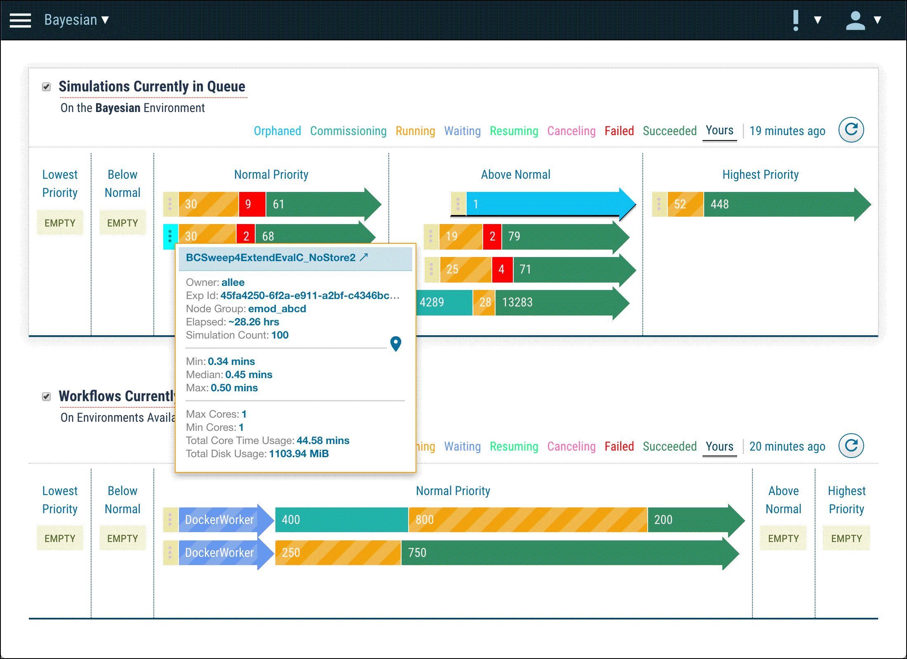

###### This is released software. Please **[log issues](/issues)** found.
# Dashboard
A Means for Visualizing Progress of Work Processing on High Performance Computing (HPC) Cluster as Implemented by the Institute for Disease Modeling's **Computational Modeling Platform Service** (COMPS)

This JavaScript module, [queueView.js](/queueView.js), should allow a web client to facilitate access to data available from the [COMPS API](https://comps.idmod.org/api/metadata) via conventional Representational State Transfer (REST) protocol, also known as [RESTful web services](https://en.wikipedia.org/wiki/Representational_state_transfer).

This is the same code implemented in the COMPS Web Client. Included within this repository is the required JavaScript, interface template (HTML), and styling (CSS). A simple demonstration is provided (see [the demo](/demo)). An illustration of this design: 

***

***

### Basic Usage
**1:** In an HTML document, simply attach the CSS and provide for an expected page structure (the code leverages this structure to append other elements at runtime):
```html
<head>
  <link rel="stylesheet" href="path/to/idm-dashboard.css">
</head>
<body>
  <div itemid="myQueueView" class="chart queue fullwidth">
    <form class="arrow">
      <figure class="process">
        <figcaption>
          <dl>
            <dt>
              <label><span>The Title of My Chart</span></label>
            </dt>
            <dd>The Description of My Chart</dd>
          </dl>
          <legend>
            <button class="refresh" title="Get Latest">
              <i class="material-icons">refresh</i>
            </button>
          </legend>
        </figcaption>
        <output title="The Title of My Chart" id="myQueueView">
          <!-- CHART RENDERS HERE -->
        </output>
      </figure>
    </form>
  </div>
</body>
```
**2:** The JavaScript component of this code expects to be imported into an ES6-compliant application and then instatiated with configuration options which describe the page environment to the code: 
```javascript
import Queue from "path/to/queueView.js";

// instantiate the chart...
const queue = new Queue({
  selector: "[itemid=myQueueView]", /* root of entire assembly */
  chartContainer:"#myQueueView"
});

// render or refresh the chart...
queue.draw();
```

**3:** By default, the QueueView chart is configured to chart the Simulations of an Experiment executing in a COMPS environment. However, the data which supplies this mode of the QueueView chart are expected to be supplied by routines external to this code. This data is assumed to be the normal Response of the two COMPS API calls, [/api/Metrics/Queue](https://comps.idmod.org/api/json/metadata?op=MetricsQueueGetRequest) and [/api/Experiments/Stats](https://comps.idmod.org/api/json/metadata?op=ExperimentGetStatsRequest), and can be delivered via the instantiating configuration options or the option object parameter of the draw method. So, as an alternative to the above: 
```javascript
import Queue from "path/to/queueView.js";

// instantiate the chart (with data)...
const queue = new Queue({
  selector: "[itemid=myQueueView]",
  chartContainer:"#myQueueView",
  modeEntity: "Simulations",
  queue: {QueueState:{Lowest:[{ExperimentId:"00000000-0000-0000-0000-000000000000"}]}},
  stats: {Stats:{"00000000-0000-0000-0000-000000000000":{Property:"foo"}}}
});

// render or refresh the chart (with data)...
queue.draw({
  queue: {QueueState:{Lowest:[{ExperimentId:"00000000-0000-0000-0000-000000000000"}]}},
  stats: {Stats:{"00000000-0000-0000-0000-000000000000":{Property:"foo"}}}
});
```

**4:** Alternatively, the QueueView chart can chart the Related processes of Work Items executing in a COMPS environment. The data which supplies this mode of the QueueView chart is gotten from the Request-Response routines internal to this code. These are the required configuration changes for implementing the Work Items mode: 
```javascript
import Queue from "path/to/queueView.js";

// instantiate the chart (for Work Items)...
const queue = new Queue({
  selector: "[itemid=myQueueView]",
  chartContainer:"#myQueueView",
  modeEntity: "WorkItems"
});

// render or refresh the chart...
queue.draw();
```

**5:** The QueueView chart can also chart [mock data](demo/data) or [repro capture](demo/data/repro.json) in either the Simulations or Work Items mode. The mocked data is essentially the expected Response JSON of each of the requisite Requests. The repro data can be captured from a running implementation for investigating any scenario that might occur. Using static data like these can facilitate development and testing of the code since a wide variety of scenarios can be tweaked into static data without actually running the corresponding work in COMPS. The QueueView has mechanisms internal to the code and an externalized API to navigate these sources. The required configuration changes for implementing mock data: 
```javascript
import Queue from "path/to/queueView.js";

// instantiate the chart (for mock data)...
const queue = new Queue({
  selector: "[itemid=myQueueView]",
  chartContainer:"#myQueueView",
  modeEntity: "WorkItems", /* or "Simulations" */
  useMockData: true,
  mockPath: "built/path/to/mock/data/", /* expected JSON should be here */
  api: function(mode,refresh) {
    /* Called upon mock draw from QueueView but within this scope.  */
  }
});

// render or refresh the chart...
queue.draw();
```

***

### Installation
This code is not intended as a standalone component which can simply be imported into a project. Some manual integration is necessary, especially the loading of expected CSS styes, HTML structures, and a JavaScript controller to supply Request-Response for Simulations (at least). However, it is possible to download this repository and run [the demo](/demo) to learn and better understand its mechanics. As well, this repository is intended for future development or could be forked as a starting place for alternative development. 

See [the demo](/demo) for instructions about running this application standalone. 

***

### Configuration Options
When instantiating this code, a configuration object is passed to the initializing method:
```javascript
import Queue from "path/to/queueView.js";

// instantiate the chart...
const queue = new Queue({
  selector: "[itemid=myQueueView]", /* root of entire assembly */
  chartContainer:"#myQueueView"
});
```
This supplies the code with any customizing parameters necessary for the particular implementation. It is not necessary to provide properties which are expected to assume the default. At runtime, these values can be gotten by the web client via the instance's [public API method](#public-methods-api), getConfig();

Most configurations have [public API method](#public-methods-api) for runtime adjustment.

| Property | Data Type | Default | Options |
|----------|-----------|---------|---------|
| `selector` | *String* | `"[itemid=QueueView]"` | **Required** A CSS-compliant selector of the encompassing root element of markup. |
| `chartContainer` | *String* | `#QueueView` | **Required** A CSS-compliant selector of a child of the root element. |
| `scoreSize` | *Integer* | `24` | Percentage between 0-100 within which arrow widths are scaled to show disparity. |
| `auth` | *Function* | `window.idmauth` | Returns an Auth instance, or internal NOP (nullifying calls). |
| `modeEntity` | *String* | `"Simulations"` | Also accepts "WorkItems". |
| `workFlowScope` | *Float* | `0` | Default disables, any float searches Work Items from that many days ago. |
| `workFlowsActive` | *Boolean* | `true` | False shows all Work Items, regardless of the state of Related items. |
| `useMockData` | *Boolean* | `false` | True expects mock data to supply the chart (not REST Request-Response). |
| `mockChoice` | *String* | `""` | A path relative to built code where default mock data resides. |
| `logging` | *Boolean* | `false` | True prints data collection to JavaScript console upon every render. |

***
### Public Methods (API)

Once instantiated in the web client code (see [Basic Usage](#basic-usage)), the local logic can be addressed via a variety of public methods, getters, and setters. These methods can be addressed within the scope of the instantiation, or via the browser's JavaScript console (when the instance is exposed to the window namespace).

```javascript
import Queue from "path/to/queueView.js";

// instantiate the chart...
const queue = new Queue({
  selector: "[itemid=myQueueView]", /* root of entire assembly */
  chartContainer:"#myQueueView"
});

queue.render();

// To expose the instance to the global namespace for access from browser's Dev Tools: 
if (!("queue" in window)) { window["queue"] = queue; }
window.queue.toggleDebug(true);

```

See the [Configuration Options](#configuration-options) for more explanation and additional public methods.

| Method Name | Argument(s) | Description |
|-------------|-------------|-------------|
| `draw` | *Config,Callback* | The fundamental render call. See [Configuration Options](#configuration-options). |
| `render` | *none* | Renders the current chart with current configuration and data. |
| `getCollection` | *none* | Returns the merged and transformed data that drew the current chart. |
| `getCollectionCount` | *none* | Returns the total number of items in Collection (drawn and not drawn). |
| `getConfig` | *none* | Returns all the current settings, by default or overridden. | 
| `setScoreSize` | *Integer* | Percentage between 0-100 within which arrow widths are scaled to show disparity. |
| `toggleMockSelect` | *Boolean* | Exchanges legend with select-option for mock data sources. True forces this. |
| `setMock` | *Integer* | Sets final numerical directory found at mockPath, e/g `built/mockpath/1/...` |
| `setWorkFlowsScope` | *Float* | Sets number of days ago to search for non/active Top-Level Work Items. 0 disables (active only). |
| `initialized` | *none* | Returns true whenever chart has been drawn with data (even if empty). |
| `toggleDebug` | *Boolean* | Switches between logging Collection data upon render and not. True forces log. | 
| `toggleRepro` | *none* | Switches between mode/API and rendering the static repro.json. |


 
